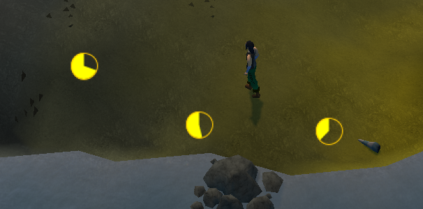

# Item Respawn Timer
Show timers for respawning items.

Show overlay countdown dials like there is for mining and woodcutting plugins.

Show a side panel of timers like the time tracking plugin.
- The timestamp of when the item will respawn is shown as minutes and seconds.
- The progress bar fills with green until the respawn time.
- After you see the item, the timer is deleted from the panel.
  - If you don't return to the spawn, the progress bar will fill a second time with grey as an indicator of how stale the information is.
    - After the stale bar fills the timer is deleted.
- If you're in a different world to the spawn, the world number will be shown on the timer.

Predictions can be slightly off. Because the respawn time depends on how many players are currently in the world, and the world populations are only periodically sent to the client.

## dev to-dos
- should startup code in injected classes be put into injected constructor like the config has?
- add config for filtering what items show in the panel
  - minimum value
  - list of items to exclude
