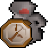

# Item Respawn Timer
Show timers for respawning items.

Predictions can be slightly off. Because the respawn time depends on how many players are currently in the world, and the world populations are only periodically sent to the client.

## Overlay

An overlay shows count-down dials (like there are for the mining and woodcutting plugins).

You can turn off the overlay with the plugin's config setting.

## Panel

A side-panel shows a list of timers (like the time-tracking plugin). From the sidebar, select the panel with the name "Item Respawns" and the icon: 

Each timer in the list shows the following information:
- The item icon and name.
- The timestamp of when the item will respawn is shown as minutes and seconds.
- The progress bar fills with green until the respawn time.
- After you see the item, the timer is deleted from the panel.
  - If you don't return to the spawn, the progress bar will fill a second time with grey as an indicator of how stale the information is.
  - After the stale bar fills the timer is deleted.
- If you're in a different world to the spawn, the world number will be shown on the timer.
